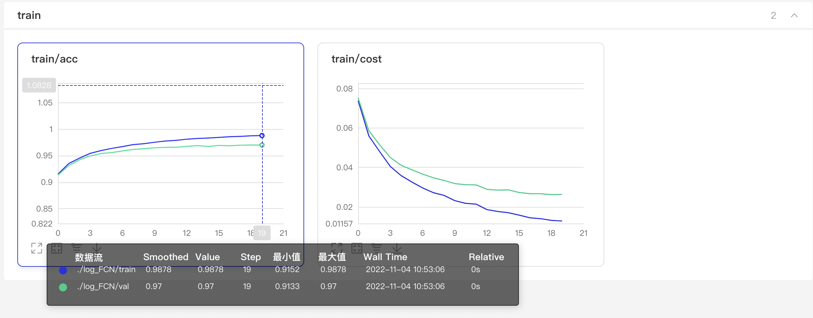

# AdML_A1：多层感知机

**问题描述如下：**


- Task: handwritten digits recognition (15 points)


- Data: MNIST data set


- In this assignment you will practice putting together a simple image classification pipeline, based on the Softmax and the fully-connected classifier. The goals of this assignment are as follows:

  - understand the basic Image Classification pipeline and the data-driven approach (train/predict stages)

  - understand the train/val/test splits and the use of validation data for hyper-parameter tuning

  - implement and apply a Softmax classifier

  - implement and apply a Fully-connected neural network classifier

  - understand the differences and tradeoffs between these classifiers implement various update rules used to optimize Neural Networks
- Do something extra! 

  - Maybe you can experiment with a different loss function and regularization? (+5 points)
- Or maybe you can experiment with different optimization algorithm (e.g., batch GD, online GD, mini-batch GD, SGD, or other optimization alg., e.g., Momentum, Adsgrad, Adam, Admax)  (+5 points)

## 数据集

jpg格式的MNIST数据集。

下载数据集：链接：https://pan.baidu.com/s/18Fz9Cpj0Lf9BC7As8frZrw 提取码：xhgk

## 使用

本项目实现了两种分类方法：Softmax回归和全连接神经网络

- **Softmax回归**

  - 训练：

  ```
  python Softmax.py
  ```

  - 测试：

  ```
  python test.py #需要调整参数
  ```

- **全连接神经网络**
	- 训练：

  ```
  python FCN.py
  ```

  - 测试：

  ```
  python test.py #需要调整参数
  ```


## 训练过程

- Softmax + 交叉熵


- Softmax + 交叉熵 + L1正则化（$\lambda=0.1$）


- Softmax + 交叉熵 + L2正则化（$\lambda=0.1$）


- FCN + 均方误差



- FCN + 交叉熵


- FCN + 交叉熵 + L1 + 0.1 lmbda


- FCN + 交叉熵 + L2 + 0.1 lmbda


## 结果

|                    Method                    |                    Weights                     | Precision | Recall |
| :------------------------------------------: | :--------------------------------------------: | :-------: | :----: |
|               Softmax + 交叉熵               | [Weights](https://pan.quark.cn/s/995a10bf8752) |    90%    |  89%   |
| Softmax + 交叉熵 + L1正则化（$\lambda=0.1$） | [Weights](https://pan.quark.cn/s/e4167c36c1e2) |    13%    |  14%   |
| Softmax + 交叉熵 + L2正则化（$\lambda=0.1$） | [Weights](https://pan.quark.cn/s/f82312c3697c) |    91%    |  91%   |
|                FCN + 均方误差                | [Weights](https://pan.quark.cn/s/5eede67e0ba3) |    97%    |  97%   |
|                 FCN + 交叉熵                 | [Weights](https://pan.quark.cn/s/8dbc94c1f203) |    98%    |  98%   |
|   FCN + 交叉熵 + L1正则化（$\lambda=0.1$）   | [Weights](https://pan.quark.cn/s/5768cac95502) |    35%    |  24%   |
|   FCN + 交叉熵 + L2正则化（$\lambda=0.1$）   | [Weights](https://pan.quark.cn/s/6010040a4b36) |    98%    |  98%   |

